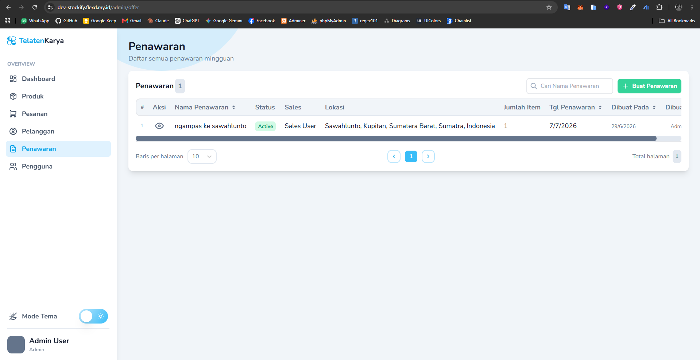
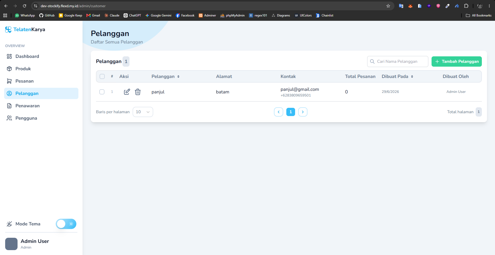
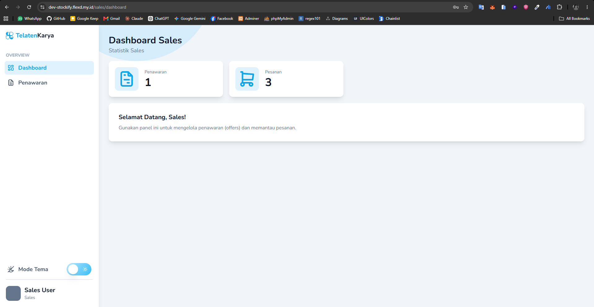

# Feature Documentation

Dokumen ini menjelaskan fitur utama ZENLAB SIISTK, aktor yang terlibat,
alur penggunaan, route terkait, controller, dan screenshot pendukung.

## Authentication dan Role Access

- Tujuan: memberi akses login dan redirect sesuai role.
- Aktor: admin, sales, customer.
- Alur: user login, sistem cek role, lalu arahkan ke dashboard yang sesuai.
- Route: `/login`, `/logout`, dan `/` untuk redirect ke `/admin/dashboard`, `/sales/dashboard`, atau `/customer/dashboard`.
- Controller: `app/Http/Controllers/Auth`.
- Screenshot: 

## Admin Dashboard

- Tujuan: menampilkan ringkasan operasional admin.
- Aktor: admin.
- Alur: admin login, masuk dashboard, melihat metrik utama dan aktivitas terbaru.
- Route: `/admin/dashboard` dan `/admin/dashboard/analytics`.
- Controller: `app/Http/Controllers/Admin/DashboardController.php`.
- Screenshot: 

## Product dan Stock Management

- Tujuan: mengelola produk dan ledger stok.
- Aktor: admin.
- Alur: admin tambah, ubah, dan lihat produk lalu mencatat stok masuk atau penyesuaian.
- Route: `/admin/product`, `/admin/product/create`, `/admin/product/bulk-create`, dan `/admin/product/{product}/stock/create`.
- Controller: `Admin/ProductController`, `Admin/StockController`.
- Screenshot: 

## Order dan Invoice Management

- Tujuan: mengelola order dan konfirmasi invoice.
- Aktor: admin, customer.
- Alur: order dibuat, invoice dikonfirmasi, lalu data transaksi dipantau.
- Route: `/admin/order`, `/admin/order/create`, `/admin/order/{order}`, `/admin/order/{order}/invoice/download`, `/order/v/{uuid}`, dan `/order/v/{uuid}/payment`.
- Controller: `Admin/OrderController`, `Admin/InvoiceController`, `PublicOrderController`.
- Screenshot: 

## Offer Workflow

- Tujuan: mengelola alur penawaran dari sales ke admin.
- Aktor: admin, sales.
- Alur: sales kirim offer record, admin review, lalu approve, reject, atau complete.
- Route: `/sales/offer`, `/sales/offer/{offer}`, `/admin/offer`, `/admin/offer/create`, dan `/admin/offer/{offer}`.
- Controller: `Admin/OfferController`, `Sales/OfferController`.
- Screenshot: 

## Customer Management

- Tujuan: mengelola data customer.
- Aktor: admin, sales, customer.
- Alur: data customer dibuat, diperbarui, dan dipakai di transaksi.
- Route: `/admin/customer`, `/admin/customer/create`, `/admin/customer/{customer}/edit`, `/customer/quick`, dan `/customer/dashboard`.
- Controller: `Admin/CustomerController`, `Customer/DashboardController`.
- Screenshot: 

## Sales Dashboard

- Tujuan: memberi ringkasan aktivitas sales.
- Aktor: sales.
- Alur: sales login, lihat aktivitas dan offer yang sedang berjalan.
- Route: `/sales/dashboard`.
- Controller: `Sales/DashboardController`.
- Screenshot: 

## Reusable UI Components

- Tujuan: menjaga UI konsisten dan reusable.
- Aktor: developer.
- Alur: halaman memakai komponen bersama untuk tabel, input, modal, dan button.
- Route: dipakai di `/admin/product`, `/admin/order`, `/admin/customer`, dan `/sales/offer`.
- Controller: tidak spesifik; dipakai lintas page.
- Screenshot: Belum tersedia.

## Catatan Update

- Screenshot untuk reusable UI perlu ditambahkan saat aset tersedia.
- Detail validasi form penting perlu dilengkapi.
- Kondisi sukses, gagal, empty state, dan error state perlu ditulis.
- Hak akses per fitur perlu diperinci.
- Acceptance criteria bisa ditambahkan per fitur.
